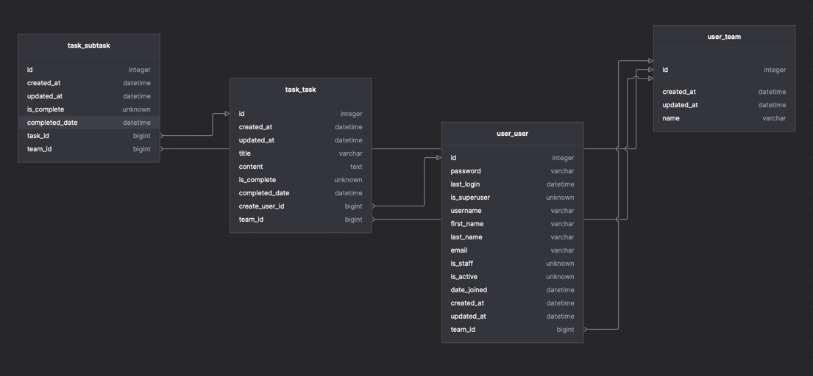

# 프로젝트 소개

## 1. 버전 및 프레임워크
- Python : 3.9.6
- Django : 4.2.8
- DRF : 3.14.0
- drf-yasg : 1.21.7
- djangorestframework-simplejwt : 5.3.1
- django-allauth : 0.58.2

## 2. 실행방법
1. git clone : `git clone {프로젝트 주소}`
2. 가상환경 세팅 : `python -m venv {가상환경 이름} && source {가상환경 이름}/bin/activate`
3. 패키지 세팅 : `pip install -r requirements.txt`
4. DB 마이그레이트 : `python manage.py migrate`
5. 테스트 데이터 생성 : `python manage.py create_test_data`
6. 서버 실행 : `python manage.py runserver`
7. 테스트 실행 : `python manage.py test`

## 3. API 문서
- 스웨거
  - http://localhost:8000/swagger/

## 4. ERD

## 5. 프로젝트 구조
- common : 공통 모듈
- conf : 세팅 모듈
- task : 업무 모듈
- user : 사용자 모듈
- .gitignore
- manage.py
- README.md
- requirements.txt